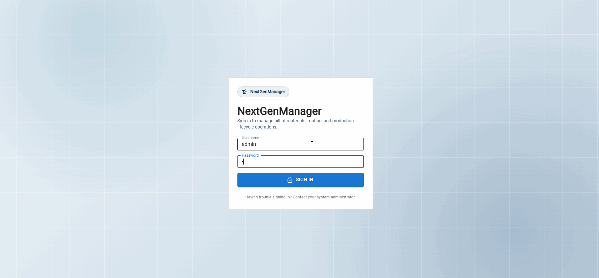
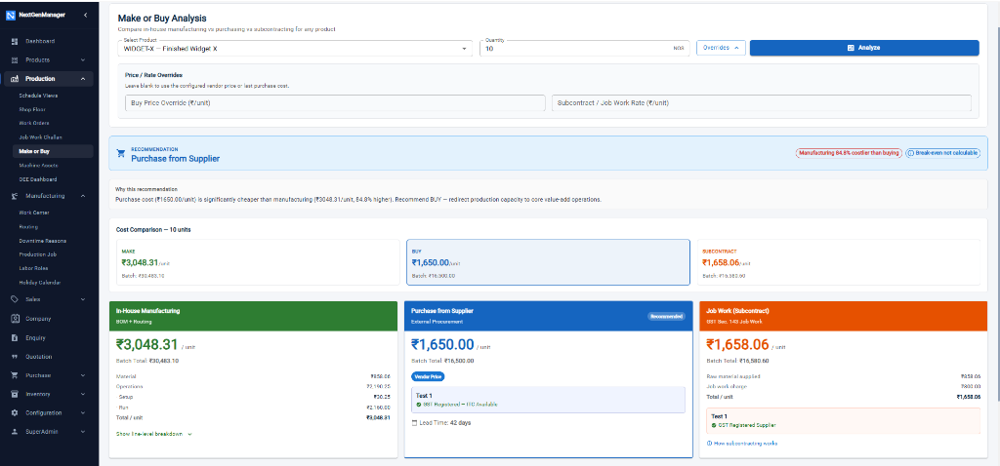
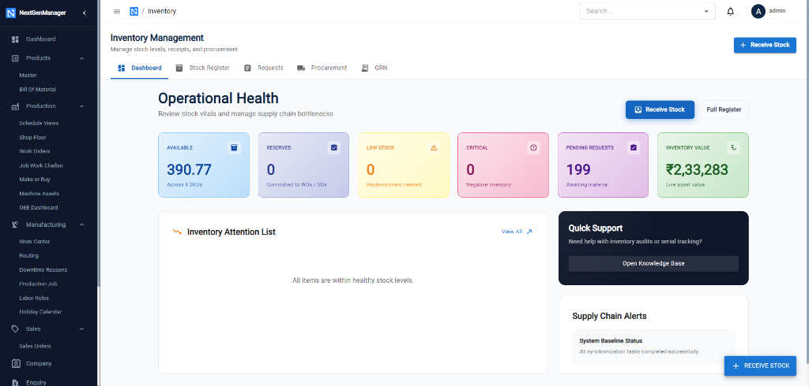
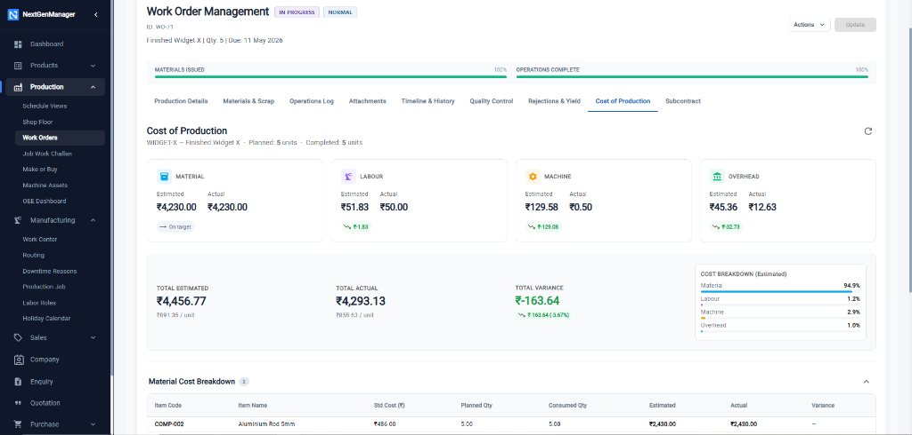
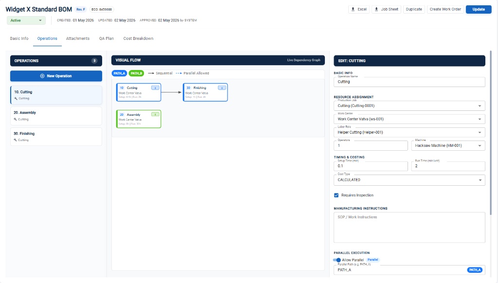
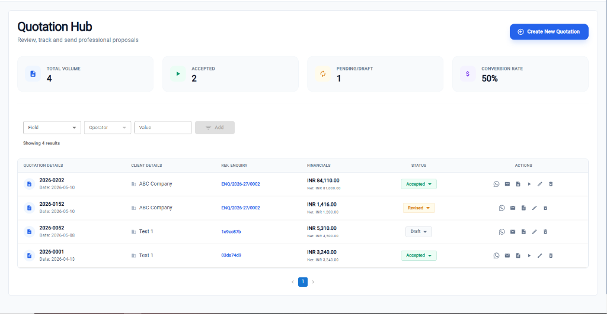
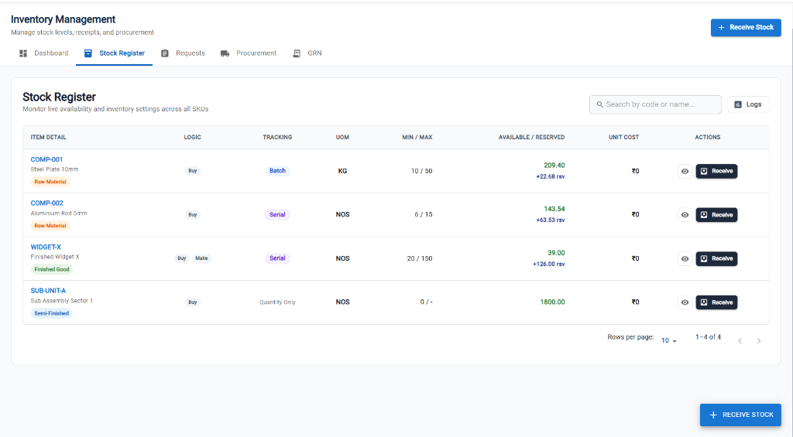
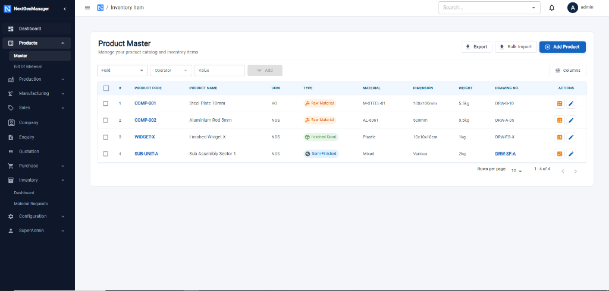
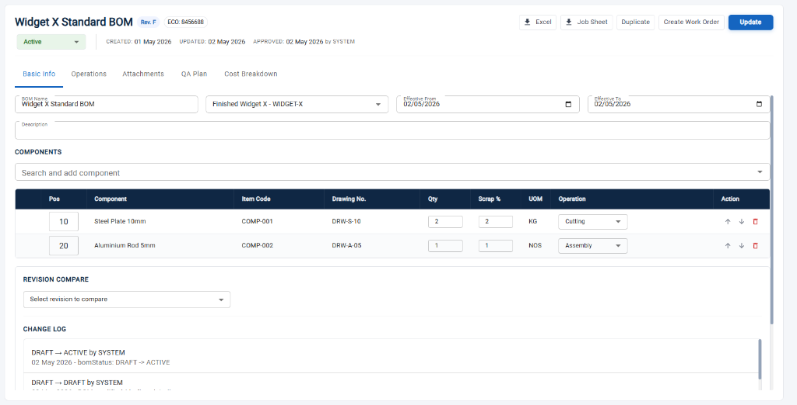
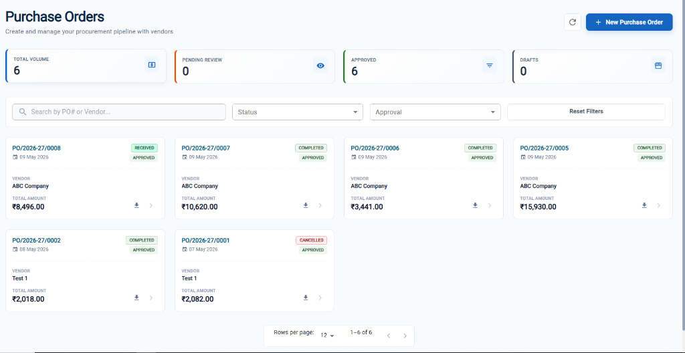

<h1 align="center">NextGenManager</h1>

<p align="center">
  <strong>Open-source Manufacturing ERP built for Indian MSMEs</strong>
</p>

<p align="center">
  <a href="#why-nextgenmanager">Why NextGenManager</a> &bull;
  <a href="#features">Features</a> &bull;
  <a href="#installation">Installation</a> &bull;
  <a href="#api-docs">API Docs</a> &bull;
  <a href="#roadmap">Roadmap</a> &bull;
  <a href="#contributing">Contributing</a>
</p>

<p align="center">
  
  
  
  
  
  <br>
  
  
  
</p>

---

<p align="center">
  
</p>
<p align="center"><em>Full walkthrough: login → dashboard → work order creation and management.</em></p>

<p align="center">
  <a href="https://github.com/siddhant2411/nextgenmanager/stargazers"><strong>⭐ Star this repo</strong></a> if you find it useful — it helps others discover the project!
</p>

---

## Why NextGenManager?

India has over **6.3 crore MSMEs** that form the backbone of the manufacturing sector. Yet most small and mid-size manufacturers still run on Excel sheets, WhatsApp groups, and paper registers — because existing ERP solutions are either too expensive or too complex to set up.

**NextGenManager is built specifically with Indian manufacturers in mind:**

- **GST & MSME compliant** — Contact records support GSTIN, MSME registration numbers, and PAN out of the box.
- **Premium Card-Based Design** — Say goodbye to dense, clunky tables. Experience a modern, intuitive layout built to increase user adoption on the shop floor.
- **Job Work Challans** — Built-in support for subcontracting workflows common in Indian manufacturing.
- **Multi-address with GST** — Manage multiple factory/godown addresses per vendor or customer, each with their own GSTIN.
- **Runs on modest hardware** — No need for expensive cloud infrastructure. Runs on a basic laptop or a Rs. 500/month VPS.
- **Zero license cost** — Free and open-source forever. No per-user fees, no hidden charges, no vendor lock-in.

---

## Strategic Decision Support

<p align="center">
  
</p>
<p align="center"><em><strong>Make vs Buy Analysis:</strong> Helps small manufacturers decide whether to produce in-house or outsource — a daily decision in Indian shop floors.</em></p>

---

## Beautiful, Intuitive UI for High Adoption

<p align="center">
  
</p>
<p align="center"><em>Modern Inventory tracking with "Operational Health" vitals and supply chain bottleneck management.</em></p>

---

## Features

### Production & Manufacturing

<p align="center">
  
</p>
<p align="center"><em>Real-time cost tracking and production management with a modern, card-based interface.</em></p>

<p align="center">
  
</p>
<p align="center"><em>Visual manufacturing routing: Define operations, work centers, and parallel execution paths.</em></p>

- **Bill of Materials (BOM)** — Multi-level BOMs with versioning, cost breakdown, where-used analysis, and ECO tracking.
- **Work Orders** — Create from BOM, track material issuance, operation progress, and state transitions.
- **Routing & Operations** — Define manufacturing processes with sequences, setup/cycle times, and parallel operations.
- **Production Scheduling** — Schedule operations against work centers with capacity planning and shift management.

### Sales & Quotations

<p align="center">
  
</p>
<p align="center"><em>Review, track, and manage professional proposals with ease.</em></p>

- **Enquiries** — Capture and track customer inquiries.
- **Quotations** — Create premium sales quotations with auto-populating items and dynamic tax configurations.
- **Sales Orders** — Full sales order lifecycle with PDF generation.
- **Job Work Challans** — Subcontracting management with challan tracking.

### Inventory & Items

<p align="center">
  
</p>
<p align="center"><em>Monitor live availability, tracking types (Batch/Serial), and inventory settings across all SKUs.</em></p>

<p align="center">
  
</p>
<p align="center"><em>Product Master: Centralized catalog for managing raw materials, semi-finished, and finished goods.</em></p>

<p align="center">
  
</p>
<p align="center"><em>Detailed BOM management: Component tracking, revision comparison, and change logs.</em></p>

### Procurement & Purchasing

<p align="center">
  
</p>
<p align="center"><em>Procurement pipeline: Manage purchase orders, vendor approvals, and receiving workflows.</em></p>

- **Purchase Orders** — Vendor approvals, receiving workflows, and PO-to-GRN tracking.

### Accounting & Compliance

Full Indian-compliance accounting stack built directly into the ERP — no separate Tally sync required.

- **Chart of Accounts & Vouchers** — Configurable CoA with a statutory voucher system (journal, payment, receipt, contra) and an approval framework.
- **Auto-Posting from Operations** — Sales and purchase transactions post to the ledger automatically (AR/AP), keeping books in sync with the shop floor.
- **Perpetual Inventory** — Real-time stock-to-GL reconciliation, so inventory value on the books always matches physical stock movement.
- **GST Compliance** — GST register, HSN summary, and GSTR-1 / GSTR-3B return generation.
- **TDS** — TDS at time of payment, section-wise tracking, and challan/26Q reporting.
- **Opening Balances & Financial Years** — Mid-year opening balance entry and financial year period management.
- **Accounting Reports** — Built-in reporting across ledgers, GST, and TDS.

---

## Installation

### Option 1: Docker Compose — Local Machine

The easiest way to get NextGenManager up and running on your laptop.

```bash
# 1. Clone both repositories into the same parent folder
git clone https://github.com/siddhant2411/nextgenmanager.git
git clone https://github.com/siddhant2411/nextgenmanagerui.git

# 2. Fire up the full platform (backend + frontend + postgres + minio)
cd nextgenmanager
docker-compose up --build
```

| Service | URL |
|---------|-----|
| UI | `http://localhost:3000` |
| Backend API | `http://localhost:8080` |
| MinIO Console | `http://localhost:9001` (minioadmin / minioadmin) |

After MinIO is up, open `http://localhost:9001` and create a bucket named **`nextgenmanager`**.

---

### Option 2: Docker Compose — Remote Server / VPS

Use this when deploying to a cloud VM or any server with a public IP or domain.

The React frontend bakes the API URL at **build time**, so you must pass your server's address before building.

#### Step 1: On your server, clone both repos side by side

```bash
git clone https://github.com/siddhant2411/nextgenmanager.git
git clone https://github.com/siddhant2411/nextgenmanagerui.git
```

#### Step 2: Set your server's API URL and start

Replace `YOUR_SERVER_IP` with your actual IP address or domain name:

```bash
cd nextgenmanager
API_URL=http://YOUR_SERVER_IP:8080/api docker-compose up --build -d
```

Or create a `.env` file next to `docker-compose.yml` so you don't have to repeat it:

```bash
# nextgenmanager/.env
API_URL=http://YOUR_SERVER_IP:8080/api
```

Then just run:

```bash
docker-compose up --build -d
```

| Service | URL |
|---------|-----|
| UI | `http://YOUR_SERVER_IP:3000` |
| Backend API | `http://YOUR_SERVER_IP:8080` |
| MinIO Console | `http://YOUR_SERVER_IP:9001` |

> **Before going live** — change the default `POSTGRES_PASSWORD`, `MINIO_ROOT_PASSWORD`, and `SECURITY_JWT_SECRET` values in `docker-compose.yml` to strong secrets.

---

### Option 3: Manual Setup (Development)

Complete guide to set up **both the backend and the frontend** on your machine.

#### Prerequisites

| Software | Version | Download |
|----------|---------|----------|
| **Java JDK** | 17 or higher | [Download](https://adoptium.net/) |
| **Node.js** | 18+ (includes npm) | [Download](https://nodejs.org/) |
| **PostgreSQL** | 15 or higher | [Download](https://www.postgresql.org/download/) |
| **MinIO** | Latest | [Download](https://min.io/download) |

#### Step 1: Clone Repositories
```bash
git clone https://github.com/siddhant2411/nextgenmanager.git
git clone https://github.com/siddhant2411/nextgenmanagerui.git
```

#### Step 2: Configure & Start
Detailed steps for [Backend Setup](nextgenmanager/README.md) and [Frontend Setup](nextgenmanagerui/README.md).

---

## API Docs

Once the backend is running, interactive API documentation is available at:

- **Swagger UI:** `http://localhost:8080/swagger-ui.html`
- **OpenAPI JSON:** `http://localhost:8080/v3/api-docs`

All endpoints are grouped by module and require a JWT bearer token obtained from `POST /api/auth/login`.

---

## Roadmap

### In Progress
- [ ] Financial statements (P&L, Balance Sheet, Cash Flow), bank reconciliation, and FY year-end close.
- [ ] Quality Control (QC) inspection workflows.
- [ ] Save Filters for users
- [ ] Complete MCP Support

### Planned
- [ ] Mobile-responsive PWA for shop floor use.

---

## Contributing

Contributions are very welcome! Whether you're fixing a bug, adding a feature, or improving documentation:

1. **Find an issue** — Check the [issue tracker](https://github.com/siddhant2411/nextgenmanager/issues).
2. **Fork & Branch** — Create a feature branch for your changes.
3. **Open a PR** — Describe your changes clearly in the pull request.

Please see [CONTRIBUTING.md](CONTRIBUTING.md) for more details.

---

## Support & Contact

- **Email:** siddhantmavani1@gmail.com
- **GitHub Issues:** [Open an issue](https://github.com/siddhant2411/nextgenmanager/issues) for bugs or feature requests

---

## License

This project is licensed under the Apache License 2.0. See the [LICENSE](LICENSE) file for details.

---

<p align="center">
  Built in India, for Indian manufacturers — and for manufacturers everywhere.
</p>

<p align="center">
  <a href="https://github.com/siddhant2411/nextgenmanager/stargazers">⭐ Star this repo</a> &bull;
  <a href="https://github.com/siddhant2411/nextgenmanager/issues">Report a Bug</a> &bull;
  <a href="https://github.com/siddhant2411/nextgenmanager/issues">Request a Feature</a>
</p>
